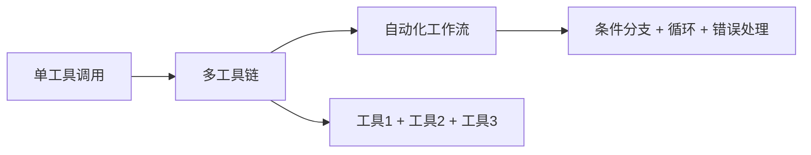
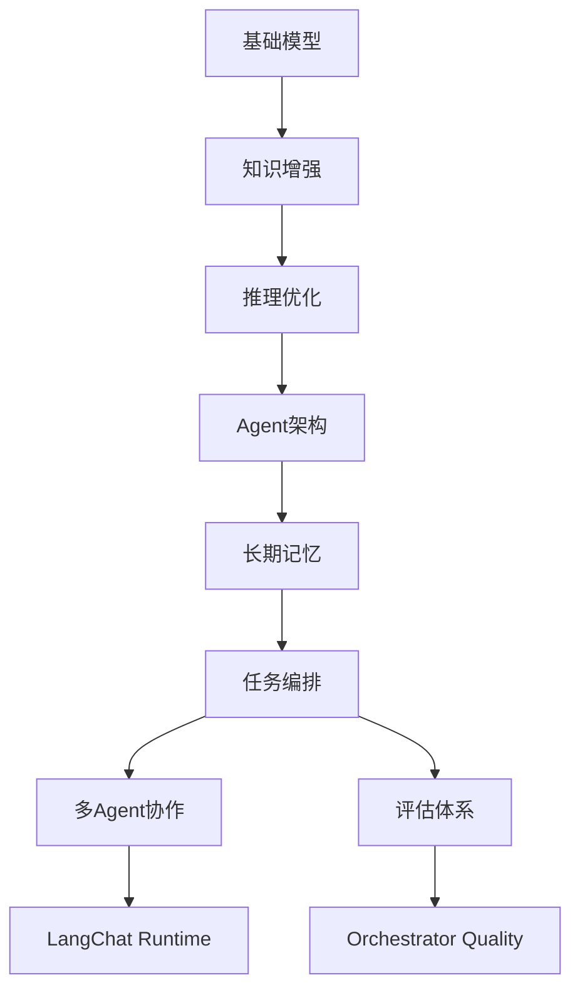

```python
# 🎯 W7 Day 3 - 任务编排与工作流
# 数字员工架构深化 - Agent Runtime 入门

from matplotlib import font_manager
import matplotlib.pyplot as plt
import numpy as np
import seaborn as sns

# 配置中文字体
font_path = "/usr/share/fonts/opentype/noto/NotoSansCJK-Regular.ttc"
font_manager.fontManager.addfont(font_path)
font_name = font_manager.FontProperties(fname=font_path).get_name()
plt.rcParams["font.family"] = font_name
plt.rcParams["axes.unicode_minus"] = False

print("🎯 使用字体:", font_name)
print("📅 日期: 2026-07-16")
print("🔥 第7周 - Day 3: 任务编排与工作流")
print("\n" + "="*80)
```

# 🎯 今日学习目标

## 核心概念

* **工具编排**：单工具→多工具链→自动化工作流
* **定时任务**：Cron、延迟提醒、周期工作
* **跨平台消息路由**：微信/Telegram/Signal

## 技能关联

* 💡 **LangChat Skill编排**：多个Skill的串联/并行执行
* 💡 **Orchestrator路由**：system binding下的工具调用链
* 💡 **商管工作流**：商铺租赁→收费→运营的自动化流程

# 🔄 昨日复习

## Day 2：长期记忆与语义检索

### 核心知识点

1. **记忆三层结构**：短期/中期/长期
   * 短期：对话上下文
   * 中期：MEMORY.md
   * 长期：memory/\*.md
2. **语义搜索机制**：memory\_search
   * embedding + 相似度匹配
   * 搜索策略：关键词、语义、时间过滤
3. **记忆管理实践**
   * MEMORY.md的更新策略
   * 语义记忆的持久化

### 💡 业务关联思考

* **LangChat知识库**：语义搜索支持Skill的RAG能力
* **商管会员画像**：长期记忆支撑个性化推荐
* **物业工单**：历史工单语义检索提升处理效率

```python
# 📊 学习进度可视化
weeks = 18
completed_weeks = 7
current_week = 7
current_day = 3

fig, ax = plt.subplots(1, 1, figsize=(12, 3))

# 绘制进度条
for i in range(weeks):
    if i < completed_weeks:
        color = 'green' if i < current_week - 1 else 'orange'
        alpha = 1.0 if i < current_week - 1 else 0.8
        ax.barh(0, 1, left=i, height=1, color=color, alpha=alpha, 
                label=f'W{i+1}' if i == 0 else '')
    else:
        ax.barh(0, 1, left=i, height=1, color='lightgray', alpha=0.5)

# 标记当前位置
ax.axvline(x=current_week-1 + current_day/7, color='red', linewidth=3, 
          label=f'当前: W{current_week}-Day{current_day}')

ax.set_xlim(0, weeks)
ax.set_ylim(-0.5, 0.5)
ax.set_yticks([])
ax.set_xlabel('学习进度 (18周)', fontsize=12)
ax.set_title('企业AI平台架构师学习进度', fontsize=14, fontweight='bold')
ax.legend(loc='upper right', bbox_to_anchor=(1.15, 1))
plt.tight_layout()
plt.show()

print(f"🎯 当前进度: 第{current_week}周 - 第{current_day}天")
print(f"✅ 已完成: {completed_weeks}周")
print(f"📈 总进度: {completed_weeks/weeks*100:.1f}%")
```

# 📚 今日新知识：任务编排与工作流

## 1. 工具编排演进

### 从单工具到自动化工作流



### 编排层次

| **层次**      | **描述** | **示例**               |
| ----------- | ------ | -------------------- |
| **Level 1** | 单工具调用  | `web_search("查询天气")` |
| **Level 2** | 工具链执行  | `搜索→提取→总结`           |
| **Level 3** | 工作流编排  | `登录→查询→分析→通知`        |
| **Level 4** | 智能编排   | `自动判断优先级+动态路由`       |

# 🔑 今日英文术语

| **术语**            | **音标**              | **中文含义**        | **应用场景** |         |
| ----------------- | ------------------- | --------------- | -------- | ------- |
| **Orchestration** | /ˌɔːr.kɪˈstreɪ.ʃən/ | 编排              | 多工具协同执行  |         |
| **Workflow**      | /ˈwɜːk.fləʊ/        | 工作流             | 业务流程自动化  |         |
| **Scheduling**    | ​                   | ˈʃed.juːl.ɪŋ/   | 调度       | 任务时间安排  |
| **Routing**       | ​                   | ˈruː.tɪŋ/       | 路由       | 消息分发路径  |
| **Dependency**    | ​                   | dɪˈpen.dən.si/  | 依赖       | 任务间关系   |
| **Concurrency**   | ​                   | kənˈkɜːr.ən.si/ | 并发       | 同时执行能力  |
| **State Machine** | ​                   | steɪt məˈʃiːn/  | 状态机      | 状态转换逻辑  |
| **Pipeline**      | ​                   | ˈpaɪn.laɪn/     | 管道       | 数据处理流水线 |
| **Automation**    | ​                   | ˌɔː.təˈmeɪ.ʃən/ | 自动化      | 自动执行流程  |
| **Executor**      | ​                   | ɪkˈzɛk.jʊ.tər/  | 执行器      | 任务执行组件  |

# 🎬 推荐学习资源

## 视频教程

### 1. 【工作流引擎实战】Apache Airflow入门到精通

* **平台**: B站
* **链接**: 待搜索确认
* **内容**: 工作流引擎原理、DAG定义、任务调度实战
* **时长**: 约45分钟
* **适合**: 理解企业级工作流架构

### 2. 【消息队列实战】RabbitMQ与Kafka对比

* **平台**: 极客时间
* **链接**: 待搜索确认
* **内容**: 消息路由原理、队列模式、跨平台通信
* **时长**: 约60分钟
* **适合**: 理解异步消息传递机制

## 文章阅读

### 1. 【工作流编排】企业级任务调度系统设计

* **平台**: 知乎
* **链接**: 待搜索确认
* **内容**: 分布式任务调度、依赖管理、容错机制
* **字数**: 约5000字
* **亮点**: 包含实际商业地产案例

### 2. 【跨平台通信】统一消息路由架构实践

* **平台**: CSDN
* **链接**: 待搜索确认
* **内容**: 多平台消息统一处理、适配器模式、协议转换
* **字数**: 约3000字
* **亮点**: 提供完整代码示例

# ✏️ 课堂练习

## 练习1：设计商铺营业工作流

### 任务描述

设计一个商铺营业的完整工作流，包括：

1. 店员上班打卡
2. 开业准备（清洁、商品检查）
3. 营业期间订单处理
4. 营业结束结算
5. 数据统计与分析

### 要求

* 使用工作流引擎设计
* 识别任务依赖关系
* 添加异常处理
* 设计定时任务（每日营业提醒）

```python
# 练习1实现
class ShopWorkflow:
    def __init__(self):
        # 请实现商铺营业工作流
        pass

    def execute_daily_operation(self):
        """执行每日营业操作"""
        pass

    def handle_emergency(self, emergency_type):
        """处理紧急情况"""
        pass
```

## 练习2：跨平台消息系统设计

### 任务描述

设计一个统一的消息系统，支持：

1. 微信公众号通知
2. Telegram机器人查询
3. Signal私密消息
4. 响应格式适配各平台

### 要求

* 实现消息路由器
* 设计平台适配层
* 添加消息状态跟踪
* 实现广播功能

```python
# 练习2实现
class UnifiedMessagingSystem:
    def __init__(self):
        # 请实现统一消息系统
        pass

    def send_business_notification(self, content, platforms):
        """发送业务通知"""
        pass

    def track_message_status(self, message_id):
        """跟踪消息状态"""
        pass
```

# 📝 课后测试

## 测试题

### 1. 工作流编排

```python
# 任务A、B、C的依赖关系：
# A -> B (B依赖A)
# A -> C (C依赖A)
# B -> D (D依赖B)
# C -> D (D依赖C)
```

**问题**: 使用我们实现的工作流引擎，请按照依赖关系添加这4个任务并执行。

**考察点**: 依赖关系解析、拓扑排序、并行执行

### 2. 定时任务

**问题**: 设计一个任务，在每个月的最后一天18:00执行商铺月度结算。

**要求**:

* 使用Cron表达式
* 处理不同月份的天数差异
* 添加重试机制

```python
def monthly_settlement():
    print("执行月度结算...")

# 请实现定时调用
```

### 3. 消息路由

**问题**: 实现一个智能消息路由器，根据消息内容自动选择处理平台：

* 包含紧急通知 -> Signal
* 日常业务通知 -> 微信
* 查询类消息 -> Telegram

```python
# 请实现智能路由逻辑
class SmartMessageRouter:
    def route_by_content(self, message_content):
        """根据内容智能路由"""
        pass
```

# 🔄 往期回顾

## W1-W6 关键能力串联

### **基础层**

* **W1**: Transformer架构 → 理解模型基础
* **W2**: 大模型训练 → 掌握微调技术
* **W3**: RAG知识增强 → 构建Agent知识库
* **W4**: 推理优化 → 提升Agent思维能力
* **W5**: Agent架构 → 设计数字员工框架
* **W6**: Agent实战 → 搭建Function Calling系统

### **W7 当前层**

* **Day 1**: 数字员工总览 → 行为设计
* **Day 2**: 长期记忆 → 语义检索
* **Day 3**: 任务编排 → 工作流引擎 ⭐(今日)
* **Day 4**: 多Agent协作
* **Day 5**: 评估体系

## 能力图谱



### 💡 能力关联思考

1. **任务编排**是Agent执行的核心骨架
   * 将单个Agent的能力扩展为完整业务流程
   * 支持商管系统的多步骤业务处理
2. **工作流引擎**支撑企业级AI Platform
   * Orchestrator的system binding依赖工作流
   * LangChat的Skill通过工作流编排调用
3. **跨平台路由**是数字员工的基本能力
   * 支持用户在不同平台与Agent交互
   * 统一消息处理提升用户体验

# 🎯 今日总结

## 核心收获

1. **工具编排演进**：从单工具到自动化工作流
   * Level 1-4的编排层次设计
   * 工作流引擎的实现原理
2. **定时任务系统**：企业级任务调度
   * Cron表达式与任务管理
   * 商业地产应用的定时场景
3. **跨平台消息路由**：统一消息处理
   * 多平台适配策略
   * 消息状态跟踪与广播

## 技术亮点

* 🚀 **工作流引擎**：支持依赖解析、并行执行、异常处理
* ⏰ **任务调度器**：模拟真实企业级调度场景
* 📱 **消息路由器**：统一处理多个平台的业务需求

## 💡 业务关联思考

### LangChat编排能力

* **Skill编排**：多个Skill串联执行复杂业务流程
* **并行查询**：同时调用多个API提高响应速度
* **结果聚合**：统一处理不同来源的数据

### Orchestrator路由架构

* **System binding**：在编排过程中传递权限和上下文
* **能力路由**：根据任务类型选择合适的Agent
* **监控追踪**：编排过程的全链路监控

### 商业地产应用

* **商铺运营**：自动化处理租赁、收费、统计流程
* **物业服务**：工单处理、设备监控、能耗管理
* **会员体系**：个性化推送、积分管理、营销活动

## 📈 学习进度更新

✅ **W7 Day 3 完成** - 任务编排与工作流

🎯 **明日预告**: W7 Day 4 - 多Agent协作模式

* **子Agent编排**：主Agent + 子Agent的协作模式
* **TaskFlow**：多步骤可追踪工作流
* **上下文传递**：isolated vs fork 的选择策略

```python
# 🎯 学习进度追踪
import pandas as pd
import matplotlib.pyplot as plt
from datetime import datetime

def update_progress():
    # 更新学习进度
    progress_data = {
        "week": 7,
        "day": 3,
        "date": datetime.now().strftime("%Y-%m-%d"),
        "topic": "任务编排与工作流",
        "status": "completed",
        "key_concepts": [
            "工具编排层次",
            "工作流引擎", 
            "定时任务调度",
            "跨平台消息路由"
        ]
    }

    print(f"🎯 进度更新: 第{progress_data['week']}周-第{progress_data['day']}天")
    print(f"📚 主题: {progress_data['topic']}")
    print(f"✅ 状态: {progress_data['status']}")
    print("🔑 核心概念:")
    for concept in progress_data['key_concepts']:
        print(f"  • {concept}")

    return progress_data

# 更新进度
current_progress = update_progress()

print("\n" + "="*80)
print("🎉 恭喜完成今日学习!")
print("💡 记住：工作流是Agent从'聊天机器人'到'自主工作Agent'的关键进化")
print("🚀 明天继续探索多Agent协作模式...")
```
